# Virtual Fridge

## Założenia projektu

Stworzenie aplikacji frontendowej używając biblioteki ReactJS wraz z wykorzystaniem Firebase'a jako backend.

Aplikacja służyć ma do dzielonego tworzenia wirtualnej lodówki na której umieszcza się notatki. 

## Funkcjonalności

- Rejestracja oraz logowanie za pomocą maila oraz za pomocą konta google dzięki opcji autentykacji w konsoli Firebase.
- Tworzenie tablicy: ustalenie nazwy i opisu tablicy, dodanie osób współdzielących tablicę - adresy email.
- Wejście na tablicę:
    - Dodanie notatek
    - Przemieszczanie notatek
    - Zmiana rozmiaru notatek
    - Wypełnianie notatek:
        - Klawiatura
        - Speech recognition
    - Odczytywanie notatki TTS
    - Usuwanie notatki
    - Skalowanie - pinch to zoom
- Dodanie osób współdzielących daną tablicę
- Usuwanie tablicy

## Technologie
- ReactJS 18.2.0
- Tailwind CSS
- Firebase - backend as a service

## Wygląd aplikacji
- Logowanie i rejestracja
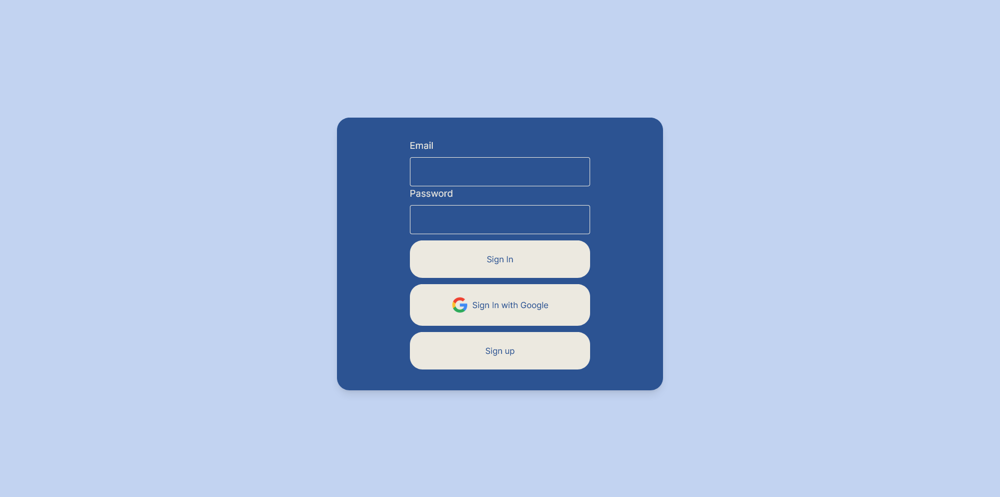
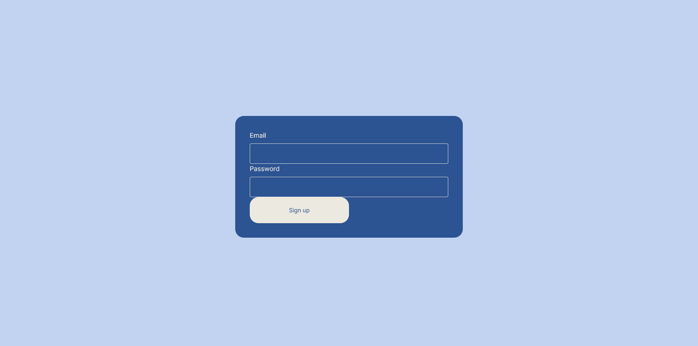

- Dashboard
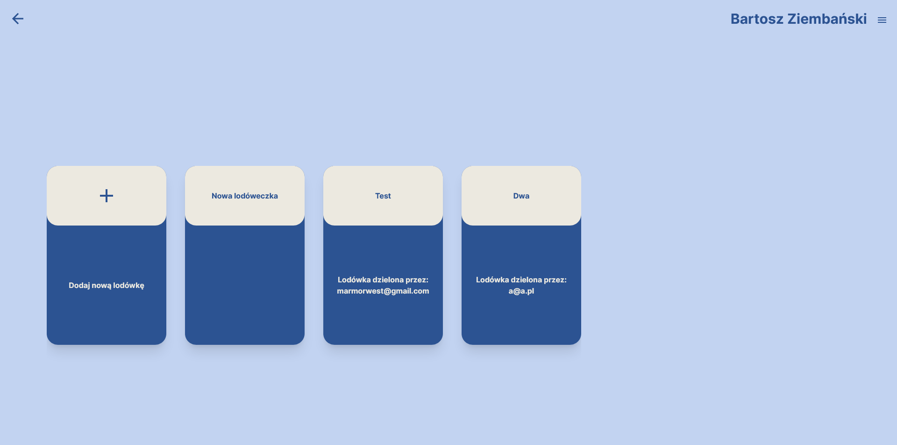
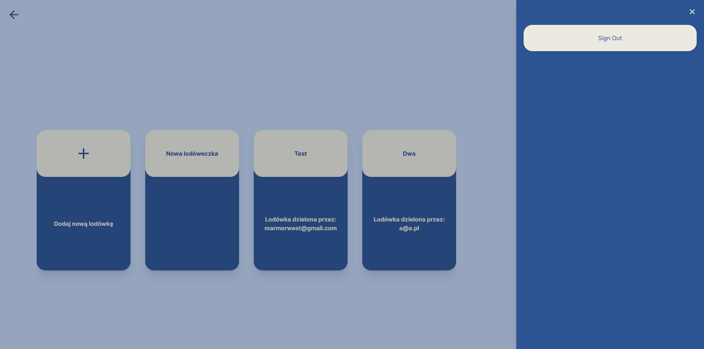

- Tworzenie lodówki
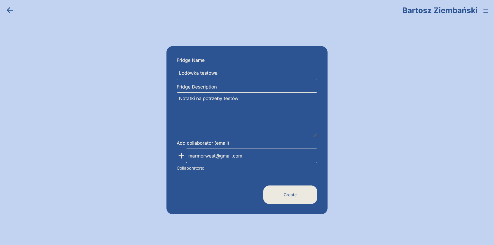
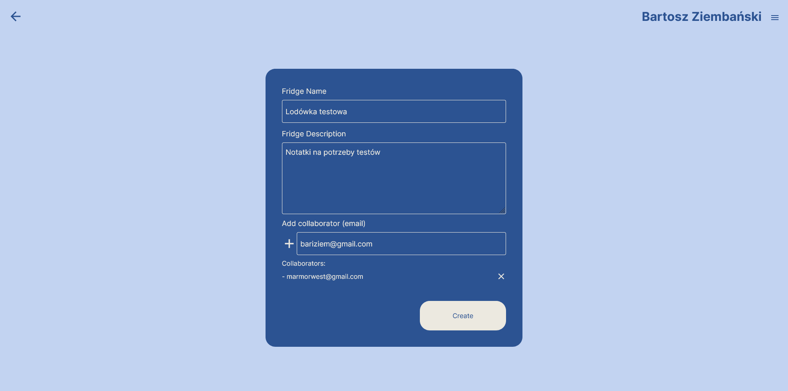

- Lodówka
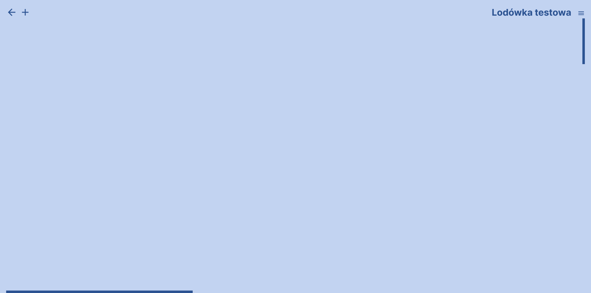
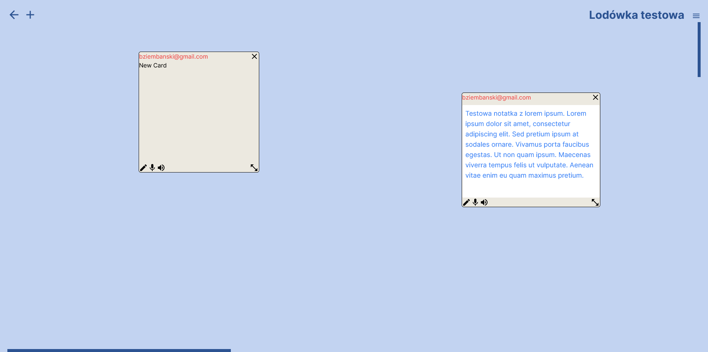
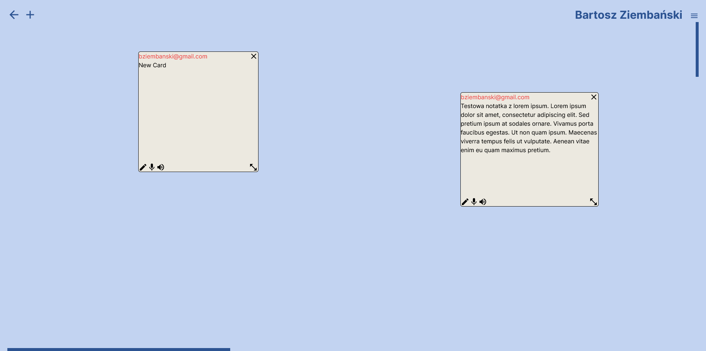
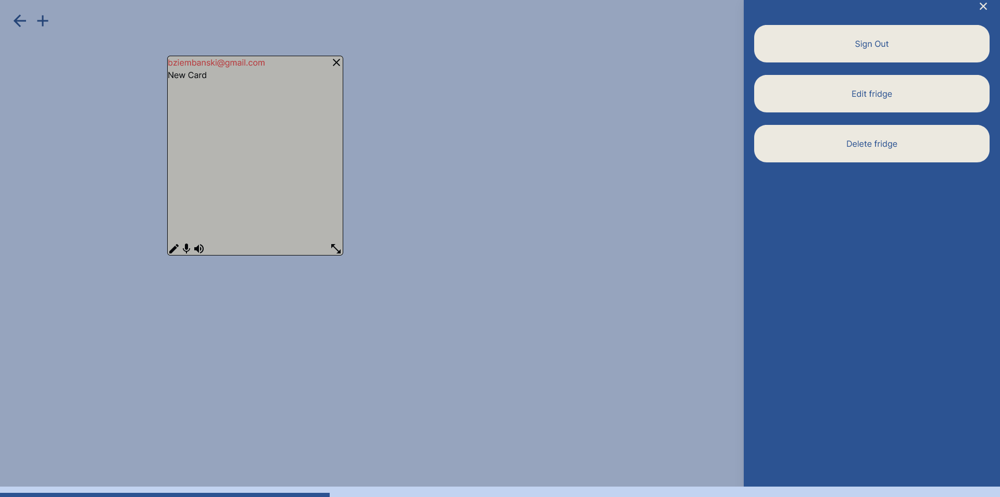
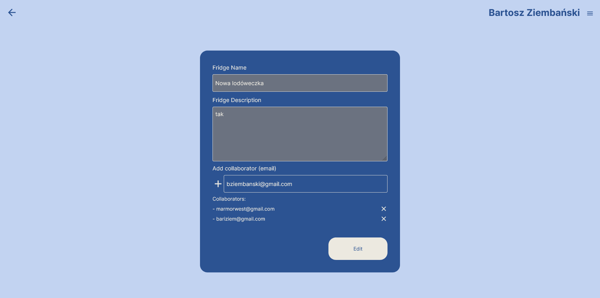

